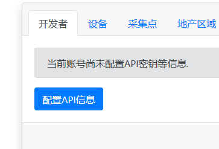
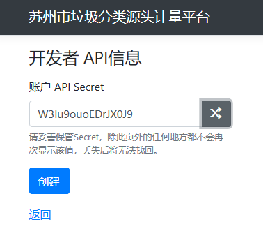
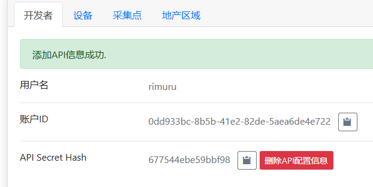
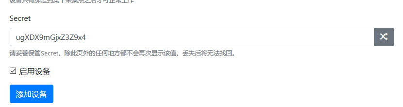
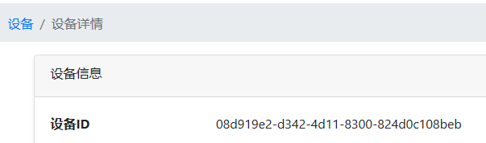

# API 接入指南

当前平台以开发如下API接入形式:

- RESTFUL WebAPI (HTTPS)

 

## Web API验证

向开发平台发起Web API请求时，需要携带一些数据以确认请求者的身份并确保请求本身的安全性。

Web API分为两种验证形式：

1. 开发者账号信息验证
2. 设备信息验证

具体使用哪种验证方式请查阅具体API的说明。

其中，两种API验证方式都需要以下验证数据：

| 数据项 | 数据类型 | 描述 | 备注 |
|------|---------|-------|-----|
|`secret`| `Text` | Secret Hash | 该值由服务端生成 |
| `nonce`| `Number`(`int32`)| 流水号 | 开发者需要确保该值在`2`分钟内不重复，否则会被拒绝请求 |
| `sign`| `Text` | 数据签名Signature | 签名规则请见下方说明 |
| `time` | `Number` | UNIX时间戳 | 请求发起时的时间戳.如果时间不一致会导致请求失败|

?> 本系统采用标准UNIX时间戳，您的设备可连接至世界任意授时机构平台或使用GPS、北斗等卫星信号进行校时。

 

### 开发者账号信息验证

使用开发者账号信息验证的API，在上述验证数据的基础上，需要如下数据：

| 数据项 | 数据类型 | 描述 | 备注 |
|------|---------|-------|-----|
|`user`| `Text` | 开发者账户ID | 该值由服务端生成 |

我们可通过开发者面板的“开发者”选项卡中的“配置API信息”按钮来生成用于账号信息验证的相关数据。

其中“Api Secret”为开发者自行设置，其长度不得小于8位，不得大于32位。打开页面时会随机生成一个字符串并填入。

!> Api Secret原始值请在设置时妥善保管，丢失后无法找回。

创建完成后，我们将在页面中得到需要的账户ID信息和Secret Hash信息：

!> Secret Hash由开发者设置的Secret值通过一定方式计算得出，该计算过程不可逆且具有一定随机性，请以服务端计算结果为准，不要本地推算。

 

### 设备信息验证

使用设备信息验证的API，在上述验证数据的基础上，需要如下数据：

| 数据项 | 数据类型 | 描述 | 备注 |
|------|---------|-------|-----|
|`device`| `Text` | 设备ID | 该值由服务端生成 |

在添加或编辑设备时，开发者可以指定每个设备的Secret值，其规则与注意事项与开发者账号的Api Secret一致。

添加设备之后，开发者可在设备详情页查看到设备ID和 Secret Hash值。

 

### Web API验证方式

本平台Web API采用RESTFUL设计风格，对于`GET`、`DELETE` 等通常不在`Body`中携带参数的HTTP方法，将在HTTP请求`header`中验证所需的验证数据；对于`POST`等通常在`Body`中携带参数的HTTP方法，将在HTTP请求的`Body`中验证所需的数据。

其中在不同的参数编排格式中，`Body`中传递的数据格式略有不同.

### Web Api请求签名规则

**动态参数** ： 将`数据主体` 内的所有**必须字段**的数据**按照次序**拼接为字符串。

1. 获取`动态参数`字符串
2. 在`动态参数`字符串后方拼接`Secret`（Hash之前的原始文本），得到新字符串，记作“Secret参数”
3. 将`Secret参数`计算获取其**小写16位**MD5，得到`签名`

**签名参数计算注意事项**：

1. 可选参数不计入运算，此外备注中如有特殊标注的参数亦不计入运算。
2. 在运算数字格式时，如数字无小数，请不要携带小数点后位数。（部分编程语言中，`float`格式的`10`默认转字符串会得到`"10.00"`，这会导致签名校验失败，应改为`"10"`）

例如 [Hello World的API](/API/Hello?id=post-apihello ':target=_blank')中，需要对`greet`参数后拼接`Secret`文本，然后对其取16位小写MD5.

 

 

## MessagePack

本平台推荐使用`MessagePack`替代`JSON`作为数据编排格式，本平台不提供`JSON`格式的支持。

MessagePack是`JSON`的下一代替代品，可通过官网了解其信息: [MessagePack: It's like JSON. but fast and small. (msgpack.org)](https://msgpack.org/)

默认情况下，MessagePack的打包结果是字节集（`byte[]`）类型.

**内容协商**

使用MessagePack格式请求WebAPI方法时，请携带Http头`Accept`和`Content-Type`为`application/x-msgpack`.

 

## Protocol Buffer

Protocol Buffer是一种相较于`MessagePack`更为流行的多平台、多语言、高性能的数据序列化机制，本平台向暂时不适应`MessagePack`的开发者提供了`Protocol Buffer`格式.

**内容协商**

使用MessagePack格式请求WebAPI方法时，请携带Http头`Accept`和`Content-Type`为`application/x-protobuf`.

