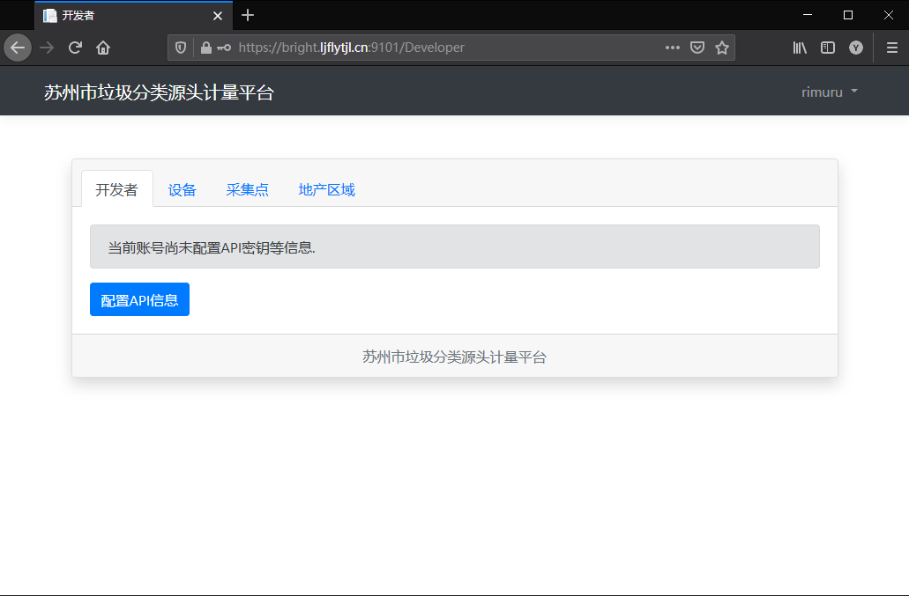
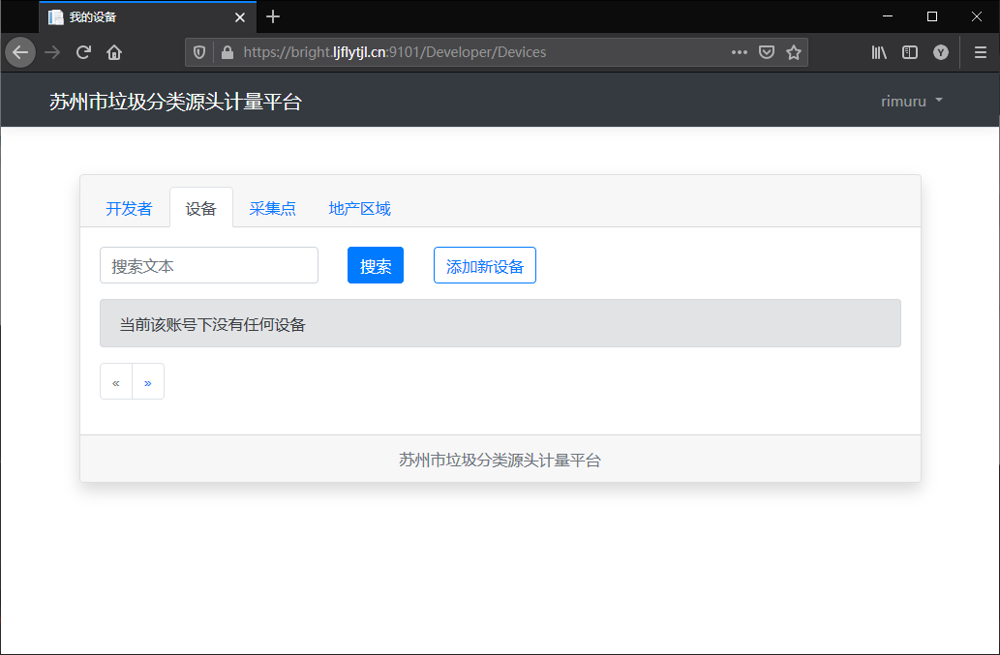

# 接入指南

## 准备工作

在申请得到平台账号后，登录平台。

 

## 设备

开发者可以在平台的开发者面板管理自己的设备。

当设备未绑定到有效的`采集点`时，该设备相关的`API`将不可用.

 

## 采集点与地产区域

地产区域：通常指一个商圈、一个小区等。

采集点：地产区域通常应该至少包括一个采集点，如通常所说的“清洁屋”就是一个采集点。

在开发者面板的“采集点”和“地产区域”选项卡中，可以查看当前账户下的采集点和地产区域信息，如需添加等操作信息，请使用API进行操作。

