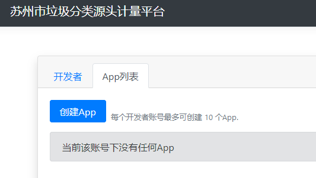

# 向开放平台推送数据

## 获取开发者账号

目前开放平台不提供自主注册账号功能，请联系平台管理人员获取开发者账号。

 

## 登录账号

请使用*现代的浏览器*访问开放平台[网站](https://gcdrp.zhongshihudong.com ':ignore :target=_blank')， 并点击登录按钮登录账号

在登录成功后，点击应用管理->App列表 访问当前账户的App列表。

 

## App

App代表开发者实际接入开放平台的基本单位，一个开发者账号可以创建多个App信息。

 

## 创建App

点击创建App按钮即可创建App信息。

其中，“App名称”仅用于后台显示，理论上可以填写任意unicode字符。

App Secret信息用于验证接入开放平台的App的身份和数据，该值可自行设置，也可使用输入框旁的“随机生成”按钮生成无规律的，安全系数较高的随机字符串作为App Secret.

!> 注意：请妥善保管App Secret信息，创建App后任何地方都不会再显示该值，如果丢失，无法找回。

 

## 查看App Secret Hash

我们可以在App列表查看创建成功的App信息

并可点击“查看细节”按钮，查看该App的ID和App Secret Hash信息。

!> 请注意：App Secret Hash将在App创建时被确定，不再变动。但App Secret Hash的计算规则是随机的，即在不同时间段或使用不同IP访问该平台创建App时，平台可能会使用不同的规则来计算Hash值。 因此请勿尝试在本地自行计算Hash值，以平台展示结果为准。

 

## 调用平台API

### 查看API

开发者可在平台开放的[API Swagger](https://gcdrp.zhongshihudong.com ':ignore :target=_blank')页面查看平台开放的Api细节。（如Api有特殊说明，可在本文档站点找到相关内容。）

### API调用方式

开发者可在文档[API接入指南](/API-Access-Guide)中查看相关说明。

### API调用案例

请访问[https://github.com/PublicViewLTD/GCDRP.ClientSample](https://github.com/PublicViewLTD/GCDRP.ClientSample ':ignore :target=_blank')查看接入案例。

各语言版本按照以下顺序陆续开放中：

- `CSharp`
- `FSharp`
- `Golang`
- `Rust`
- `TypeScript` (Node.js)
